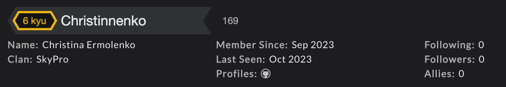

# Hi My name is Christina. I'm Frontend developer

<table style="width: 100%;">
  <tr>
    <td style="width: 70%; vertical-align: top;">
      <!-- <ul style="list-style: none; padding: 0; margin: 0;"> -->
      I am looking for a remote job or internship with the possibility of career growth and advancement. I have seven years of experience working in a large international company and in the government of the Nizhny Novgorod region. Including experience as a group leader and chief specialist.
      - 🌍 <strong>Location:</strong> Russia, Nizhny Novgorod
      - ✉️ <strong>Contact:</strong> Telegram: <a href="https://t.me/Christinnenko" target="_blank">@Christinnenko</a> or E-mail: <a href="mailto:Christinnenko@yandex.ru">Christinnenko@yandex.ru</a>
      - 🧠 <strong>Learning:</strong> React, Redux
      - 🤝 <strong>Collaboration:</strong> Open to collaborating on interesting projects
      - ⚡ <strong>Soft Skills:</strong> Mindfulness, Critical thinking, Decision making, Results orientation, Communication, Stress resistance, Constant self-improvement, and much more.

    </td>
    <td style="width: 30%; text-align: center;">
      

        
      

    </td>

  </tr>
</table>

### Skills

### Education:

| Years     | Educational institution                                                                      | Speciality                                           |
| --------- | -------------------------------------------------------------------------------------------- | ---------------------------------------------------- |
| 2023-2024 | SKYENG                                                                                       | Web Developer                                        |
| 2017-2020 | Nizhny Novgorod State Pedagogical University named after Kozma Minin (Minin University)      | Innovative Technologies in Human Resource Management |
| 2012-2016 | Nizhny Novgorod State University named after N.I. Lobachevsky (National Research University) | Personnel Management                                 |

### Courses:

| Year | Educational institution | Сourse name                              | Certificate                                                                             |
| ---- | ----------------------- | ---------------------------------------- | --------------------------------------------------------------------------------------- |
| 2023 | ITology                 | Frontend Start                           | <https://drive.google.com/file/d/192QtN8yJM5ZrkNJli6NN-jbxhFii9rOd/view?usp=drive_link> |
| 2023 | Result School           | Marathon: 5 Days - 5 JavaScript Projects | <https://drive.google.com/file/d/14q41pJ6uzRgZE8EidFnjPor8TEfOmDNv/view?usp=drive_link> |

### Language:

<table style="width: 100%;">
  <tr>
    <td style="width: 70%; vertical-align: top;">
    <ul style="list-style: none; padding: 0; margin: 0;">
      <li>Russian - native speaker</li>
      <li>English - A2 Elementary - in the process of leveling up</li>
  </ul>
    </td>
    <td style="width: 30%; text-align: center;">
      

        
      

    </td>
  </tr>
</table>

### Socials

 <a href="https://www.codepen.io/Christinnenko" target="_blank" rel="noreferrer"> <picture> <source media="(prefers-color-scheme: dark)" srcset="https://raw.githubusercontent.com/danielcranney/readme-generator/main/public/icons/socials/codepen-dark.svg" /> <source media="(prefers-color-scheme: light)" srcset="https://raw.githubusercontent.com/danielcranney/readme-generator/main/public/icons/socials/codepen.svg" />  </picture> </a> <a href="https://discord.com/users/christina_28534" target="_blank" rel="noreferrer"> <picture> <source media="(prefers-color-scheme: dark)" srcset="undefined" /> <source media="(prefers-color-scheme: light)" srcset="https://raw.githubusercontent.com/danielcranney/readme-generator/main/public/icons/socials/discord.svg" />  </picture> </a> <a href="https://www.github.com/Christinnenko" target="_blank" rel="noreferrer"> <picture> <source media="(prefers-color-scheme: dark)" srcset="https://raw.githubusercontent.com/danielcranney/readme-generator/main/public/icons/socials/github-dark.svg" /> <source media="(prefers-color-scheme: light)" srcset="https://raw.githubusercontent.com/danielcranney/readme-generator/main/public/icons/socials/github.svg" />  </picture> </a> <a href="http://www.instagram.com/Christinnenko" target="_blank" rel="noreferrer"> <picture> <source media="(prefers-color-scheme: dark)" srcset="undefined" /> <source media="(prefers-color-scheme: light)" srcset="https://raw.githubusercontent.com/danielcranney/readme-generator/main/public/icons/socials/instagram.svg" />  </picture> </a>

