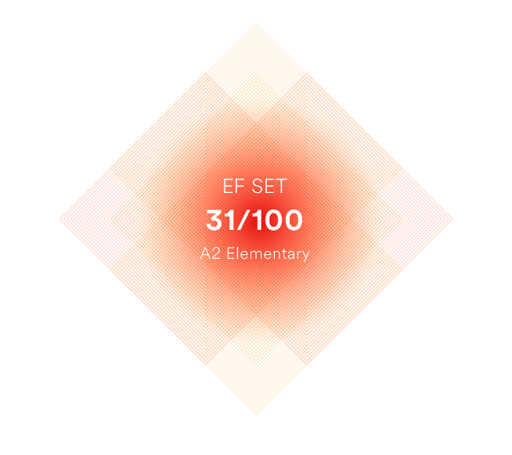

# Hi My name is Christina
## Frontend developer

I'm looking for remote job or internship opportunities with the potential for career growth and advancement. In 2020, I earned a master's degree in the area of ​​'Innovative Technologies in Human Resource Management.' My education allowed me to accumulate 7 years of experience working for a large international company and in the Nizhny Novgorod Region government. While serving as a team leader and chief specialist, I've developed skills like attentiveness, critical thinking, decision-making, result orientation, communication, stress resilience, continuous self-improvement, and more.

* 🌍  I'm based in Russia, Nizhny Novgorod
* ✉️  You can contact me at Telegram: [@Christinnenko](https://t.me/Christinnenko) or [Christinnenko@yandex.ru](mailto:Christinnenko@yandex.ru)
* 🧠  I'm learning React, Redux
* 🤝  I'm open to collaborating on interesting project

### Skills

### Education:

| Years     | Educational institution                                                                      | Speciality                                           |
| --------- | -------------------------------------------------------------------------------------------- | ---------------------------------------------------- |
| 2023-2024 | SKYENG                                                                                       | Web Developer                                        |
| 2017-2020 | Nizhny Novgorod State Pedagogical University named after Kozma Minin (Minin University)      | Innovative Technologies in Human Resource Management |
| 2012-2016 | Nizhny Novgorod State University named after N.I. Lobachevsky (National Research University) | Personnel Management                                 |

### Courses:

| Year | Educational institution | Сourse name                              | Certificate                                                                             |
| ---- | ----------------------- | ---------------------------------------- | --------------------------------------------------------------------------------------- |
| 2023 | ITology                 | Frontend Start                           | <https://drive.google.com/file/d/192QtN8yJM5ZrkNJli6NN-jbxhFii9rOd/view?usp=drive_link> |
| 2023 | Result School           | Marathon: 5 Days - 5 JavaScript Projects | <https://drive.google.com/file/d/14q41pJ6uzRgZE8EidFnjPor8TEfOmDNv/view?usp=drive_link> |

### Language:

- Russian - native speaker
- English - A2 Elementary (according to the online test at EFset Logo <www.efset.org>) 
  

### Socials

 <a href="https://www.codepen.io/Christinnenko" target="_blank" rel="noreferrer"> <picture> <source media="(prefers-color-scheme: dark)" srcset="https://raw.githubusercontent.com/danielcranney/readme-generator/main/public/icons/socials/codepen-dark.svg" /> <source media="(prefers-color-scheme: light)" srcset="https://raw.githubusercontent.com/danielcranney/readme-generator/main/public/icons/socials/codepen.svg" />  </picture> </a> <a href="https://discord.com/users/christina_28534" target="_blank" rel="noreferrer"> <picture> <source media="(prefers-color-scheme: dark)" srcset="undefined" /> <source media="(prefers-color-scheme: light)" srcset="https://raw.githubusercontent.com/danielcranney/readme-generator/main/public/icons/socials/discord.svg" />  </picture> </a> <a href="https://www.github.com/Christinnenko" target="_blank" rel="noreferrer"> <picture> <source media="(prefers-color-scheme: dark)" srcset="https://raw.githubusercontent.com/danielcranney/readme-generator/main/public/icons/socials/github-dark.svg" /> <source media="(prefers-color-scheme: light)" srcset="https://raw.githubusercontent.com/danielcranney/readme-generator/main/public/icons/socials/github.svg" />  </picture> </a> <a href="http://www.instagram.com/Christinnenko" target="_blank" rel="noreferrer"> <picture> <source media="(prefers-color-scheme: dark)" srcset="undefined" /> <source media="(prefers-color-scheme: light)" srcset="https://raw.githubusercontent.com/danielcranney/readme-generator/main/public/icons/socials/instagram.svg" />  </picture> </a>

